<h1 align="center"><b>HTML-TO-PPTX</b></h1>

<p align="center">
  <a href="https://www.python.org/"></a>
  <a href="LICENSE"></a>
  <a href="#安装"></a>
  <a href="SKILL.md"></a>
</p>

<p align="center"><sub>📖 <a href="README.md">English</a> ｜ <b>中文</b></sub></p>

把 HTML 幻灯片转换成可交付的 `.pptx`：文字尽量保持 PowerPoint 原生文本框，字体按需嵌入，复杂 CSS 装饰自动截图兜底，并生成 HTML/PPT 视觉对照材料方便审查。

<table align="center">
  <tr>
    <td width="50%">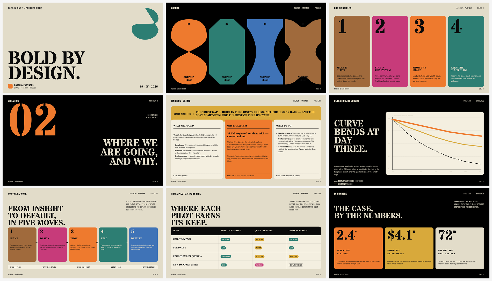</td>
    <td width="50%">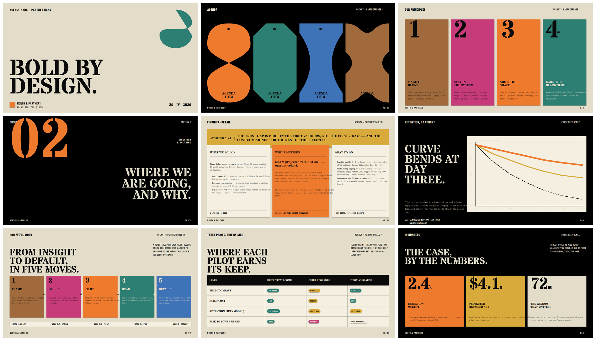</td>
  </tr>
  <tr>
    <td align="center"><sub><b>HTML 原始渲染</b></sub></td>
    <td align="center"><sub><b>html-to-pptx 输出的 .pptx 在 PowerPoint 里打开</b></sub></td>
  </tr>
</table>

<p align="center"><sub>文字保持矢量可编辑，复杂装饰局部截图兜底。</sub></p>

## 为什么做这个

HTML 很适合写演示稿：布局、字体、动效和复杂视觉都比 PowerPoint 更自由。但实际交付常常要求 `.pptx`，普通“HTML 转 PPT”方案又容易把每页压成一张大图，导致文字不可编辑、不可搜索、放大变糊。

html-to-pptx 不走“整页截图”的路线。它会把 HTML 拆成 PowerPoint 能理解的对象：文字变成可编辑文本框，简单图形变成 shape / line；遇到渐变、阴影、滤镜、混合模式这类 PPT 原生表达不了的效果，才把局部视觉截图成装饰层铺底。

结果是：输出文件尽量接近 HTML 原稿，同时仍能在 PowerPoint / WPS 里改文字、搜内容、调版式，而不是一叠不可编辑的大图。

## 越用越好

每次安装会在本地维护一份 `references/lessons-learned.md`（首次运行 convert 时从模板 seed 一次，之后 gitignored）。audit 流程中遇到通用 HTML 反模式或 OOXML 边界时，对应的写法或修复方法会沉淀到这份文件里。后续每次 convert 都会重新读取，所以风格相近的 deck 会一次比一次更顺。

本地副本永远不会被上游覆盖——`git pull` 只更新模板，不动已经沉淀下来的内容。

## 快速开始（Claude Code）

### 安装

在 Claude Code 会话里把仓库地址发给 Claude 即可：

```text
帮我装下这个 skill：https://github.com/Hasasasa/claude-skill-html-to-pptx
```

Claude 会自动 `git clone` 到对应平台的 skills 目录（macOS / Linux 是 `~/.claude/skills/`，Windows 是 `%USERPROFILE%\.claude\skills\`），并按你的系统协助安装 Python 3.10+、Playwright 和依赖包；涉及系统级安装步骤时仍会请你确认权限。

### 使用

装好之后，在 Claude Code 会话里这样说就行：

```text
把 D:\path\to\deck.html 转成 pptx
```

完整调用规则、audit 模式和修复纪律见 [SKILL.md](SKILL.md)。

## 手动使用（不通过 Claude Code）

如果不用 Claude Code，也可以自己 clone 仓库后用命令行跑。

### 安装

本机需要 Python 3.10+ 和 pip。

```bash
git clone https://github.com/Hasasasa/claude-skill-html-to-pptx.git
cd claude-skill-html-to-pptx
pip install -r requirements.txt
python -m playwright install chromium
```

视觉 audit 需要把 `.pptx` 渲染成 PNG。满足下面任一条件即可：

- Windows + Office
- LibreOffice

`requirements.txt` 已包含 `pywin32`（仅 Windows 安装）和 `pdf2image`。如果走 LibreOffice 渲染链路，系统里还需要有 LibreOffice；Windows 使用 `pdf2image` 时通常还需要安装 Poppler。没有渲染器也能生成 `.pptx`，但会跳过 HTML/PPT 双栏对照图。

### 运行

```bash
python convert.py path/to/deck.html
```

默认输出到同目录的 `path/to/deck.pptx`。首次运行会自动创建 `path/to/deck.audited.html` 工作副本，后续 audit 修复都改这个副本，不直接改原 HTML。

常用参数：

| 参数 | 作用 |
|---|---|
| `--out <path>` | 指定输出 `.pptx` 路径 |
| `--keep-screenshots` | 保留每页 HTML 参考截图和 measurement 文件 |
| `--install-user-fonts` | 把解析到的非 CJK 字体安装到用户字体目录，便于 WPS / PowerPoint COM 渲染 |
| `--no-embed-fonts` | 跳过字体嵌入，文件更小但换机可能回退字体 |
| `--no-preflight` | 跳过 Stage 1 风险预扫 |
| `--no-verify` | 跳过 Stage 5a 结构化自检 |
| `--no-visual-audit` | 跳过 Stage 5b 视觉 audit 材料生成 |
| `--only-slides 2,7,12` | 只重跑指定页的截图、渲染和对照图，适合 audit 迭代 |
| `--cleanup` | 清理 `.pptx` 旁边的 audit / measurement / preflight 中间产物 |

## 能处理什么

支持 [beautiful-html-templates](https://github.com/zarazhangrui/beautiful-html-templates) / [guizang-ppt-skill](https://github.com/op7418/guizang-ppt-skill) / Reveal.js / 自写 deck / 浏览器全屏页面等单文件 HTML 幻灯片，自动识别切页。

CSS 到 PPT 的转换通路：

| HTML 里的元素 / CSS | 在 PPT 里变成什么 |
|---|---|
| 文本、富文本、颜色、字号、字距、行高、对齐 | 可编辑文本框，可搜索可缩放 |
| 背景色、边框、圆角、线条 | OOXML 原生几何形状 |
| `gradient`、`box-shadow`、`filter`、`backdrop-filter`、`mix-blend-mode`、复杂 transform | 局部截图兜底，文字仍走矢量 |
| SVG、图片、canvas | 直接嵌入 |
| Google Fonts | 按实际用到的字符 subset 后嵌入；含中文时自动 seed Noto Sans SC / Noto Serif SC |

更完整的 CSS 覆盖范围见 [references/supported-css.md](references/supported-css.md)。

## 更多演示

每组左边是 HTML 原始渲染，右边是 html-to-pptx 转换后的 PPT 渲染。

### Signal

<table align="center">
  <tr>
    <td width="50%">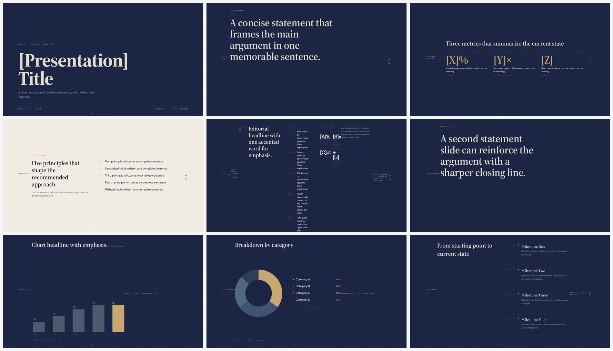</td>
    <td width="50%">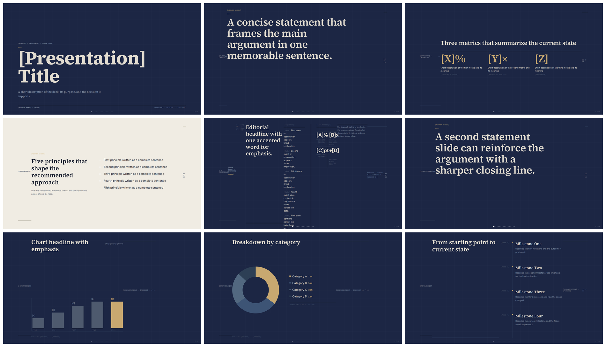</td>
  </tr>
  <tr>
    <td align="center"><sub><b>HTML 原始渲染</b></sub></td>
    <td align="center"><sub><b>html-to-pptx 输出</b></sub></td>
  </tr>
</table>

### Market Outlook

<table align="center">
  <tr>
    <td width="50%">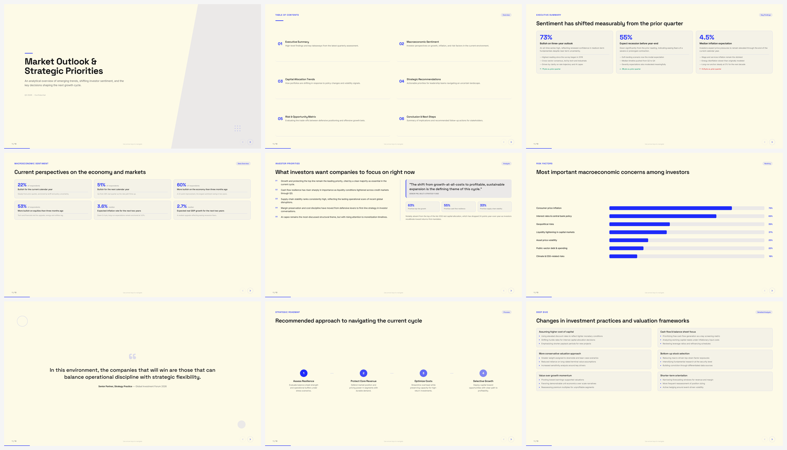</td>
    <td width="50%">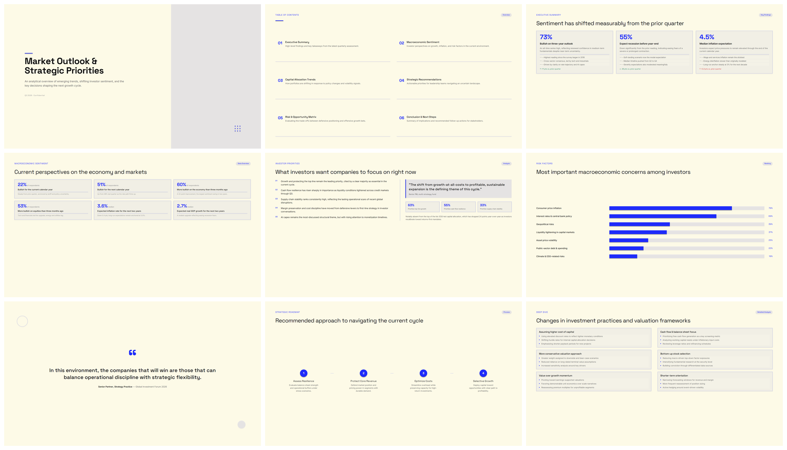</td>
  </tr>
  <tr>
    <td align="center"><sub><b>HTML 原始渲染</b></sub></td>
    <td align="center"><sub><b>html-to-pptx 输出</b></sub></td>
  </tr>
</table>

### OpenClaw 人机协作框架

<table align="center">
  <tr>
    <td width="50%">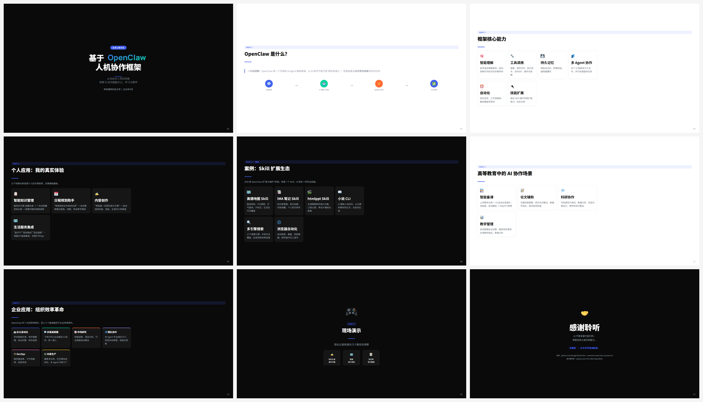</td>
    <td width="50%">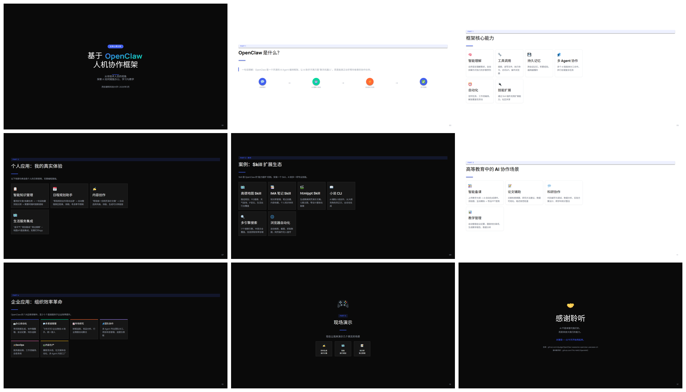</td>
  </tr>
  <tr>
    <td align="center"><sub><b>HTML 原始渲染</b></sub></td>
    <td align="center"><sub><b>html-to-pptx 输出</b></sub></td>
  </tr>
</table>

### 8-Bit Orbit

<table align="center">
  <tr>
    <td width="50%">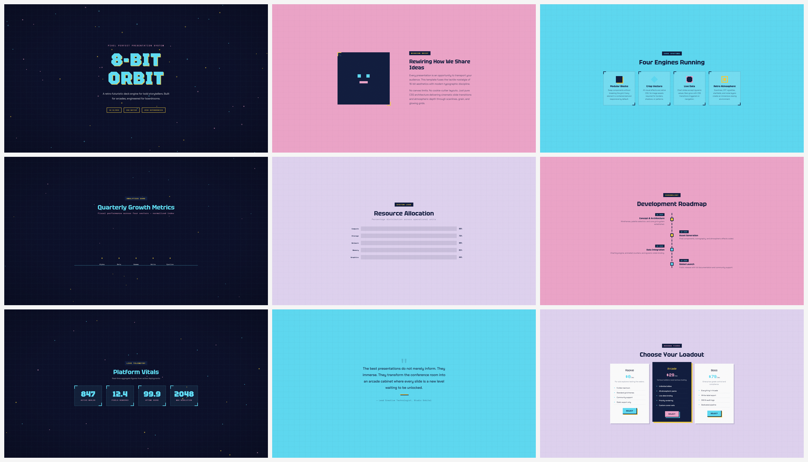</td>
    <td width="50%">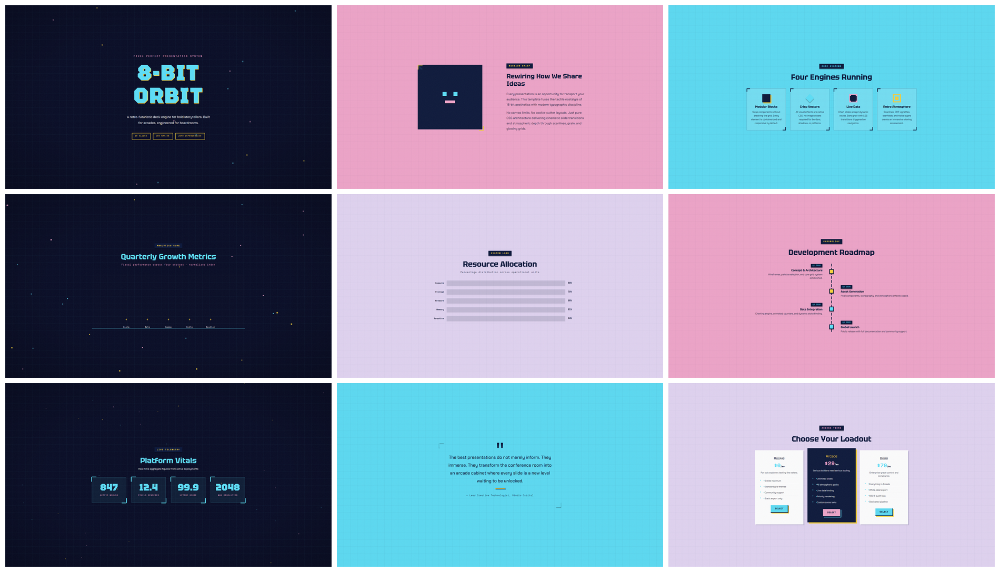</td>
  </tr>
  <tr>
    <td align="center"><sub><b>HTML 原始渲染</b></sub></td>
    <td align="center"><sub><b>html-to-pptx 输出</b></sub></td>
  </tr>
</table>

### Apex Group（Bold Poster）

<table align="center">
  <tr>
    <td width="50%">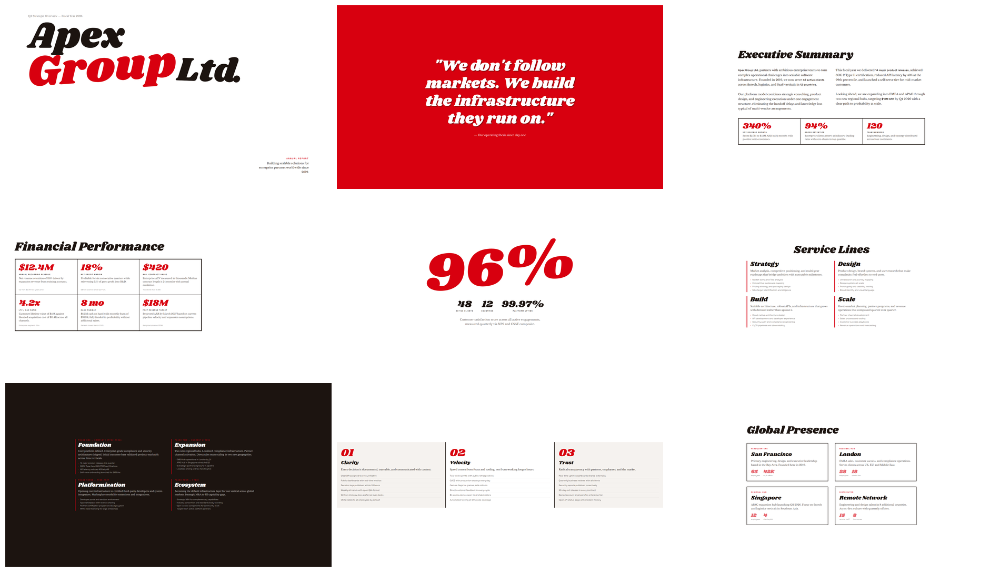</td>
    <td width="50%"></td>
  </tr>
  <tr>
    <td align="center"><sub><b>HTML 原始渲染</b></sub></td>
    <td align="center"><sub><b>html-to-pptx 输出</b></sub></td>
  </tr>
</table>

### Broadside

<table align="center">
  <tr>
    <td width="50%">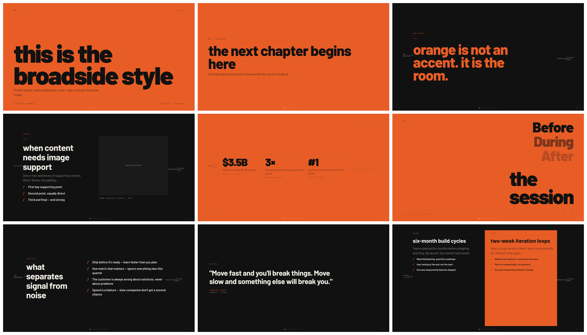</td>
    <td width="50%">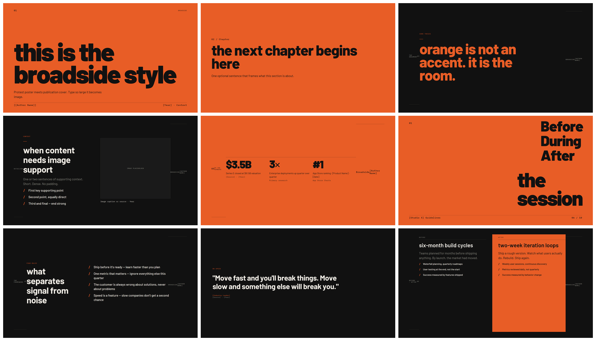</td>
  </tr>
  <tr>
    <td align="center"><sub><b>HTML 原始渲染</b></sub></td>
    <td align="center"><sub><b>html-to-pptx 输出</b></sub></td>
  </tr>
</table>

## 工作流程

```text
[1 preflight] -> [2 measure] -> [3 assemble] -> [4 embed fonts] -> [5a self check] -> [5b visual audit]
 preflight.py     measure.py      assemble.py     embed_fonts.py      self_check.py      visual_audit.py
```

- `preflight`：扫描高风险 HTML/CSS 模式。
- `measure`：用 Playwright 实测 DOM，提取文本、形状、媒体和装饰记录。
- `assemble`：写入 OOXML，生成 textbox / shape / media / snapshot。
- `embed_fonts`：按实际使用字符 subset 并嵌入字体。
- `self_check`：扫描 PPTX 结构风险，并调用渲染器导出 PPT 页图。
- `visual_audit`：生成 HTML/PPT 双栏对照图、contact sheet、audit index 和审查 prompt。

## 设计原则

| 原则 | 说明 |
|---|---|
| 矢量优先 | 文字和简单几何尽量保持 PPT 原生对象，方便编辑、搜索和缩放 |
| 局部兜底 | 只有复杂装饰走截图通道，避免整页变成一张大图 |
| 字体可迁移 | 自动解析 Google Fonts，按需 subset 嵌入，降低换机字体漂移 |
| 可审查 | 每页生成 HTML/PPT 对照材料，让视觉问题能被定位和迭代 |
| 原稿不动 | 自动创建 `.audited.html` 工作副本，保留源 HTML |

## 进一步阅读

- [SKILL.md](SKILL.md)：Claude Code skill 调用规则、audit 模式、修复纪律。
- [references/methodology.md](references/methodology.md)：五步转换流水线和反侦测检查清单。
- [references/supported-css.md](references/supported-css.md)：CSS 到 PPT 输出通道的覆盖表。
- [references/lessons-learned.md.example](references/lessons-learned.md.example)：历史问题、HTML 写法规避和 OOXML 边界。
